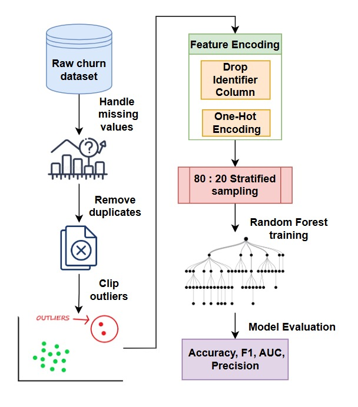
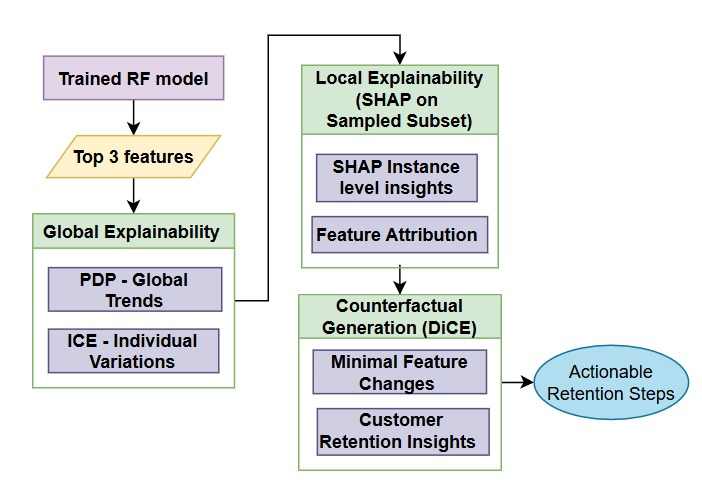

# 📘 ChurnXAI – Explainable Churn Prediction

This project builds a machine-learning model to predict **customer churn** and explains predictions using modern **Explainable AI (XAI)** techniques including SHAP, PDP, ICE, and DiCE.

Full implementation:  
➡️ **`churn-prediction-xai.ipynb`**

Dataset used (Kaggle):  
🔗 https://www.kaggle.com/datasets/muhammadshahidazeem/customer-churn-dataset

---


## 📊 Dataset Overview

The dataset contains customer demographics, billing, account activity, and usage behavior.

**Target variable:**  
- `Churn` → 1 = customer left, 0 = customer stayed

---
## 🎯 Project Objectives

- Build a reliable churn prediction model  
- Preprocess real-world customer data  
- Evaluate the model with industry-standard metrics  
- Provide **global + local** interpretability  
- Generate **counterfactual explanations (DiCE)** to understand what changes reduce churn  

---
## 🖼️ Project Workflow 

<p align="center">
  
</p>

---

## 🧠 Explainability (XAI)

| XAI Method | Purpose | Output |
|------------|----------|---------|
| **SHAP** | Global + local interpretability | Summary plot, waterfall plot, feature contributions |
| **PDP** | Global sensitivity | Average effect of one feature |
| **ICE** | Instance-level sensitivity | Individual feature response |
| **DiCE** | Counterfactual explanations | Actions required to reduce churn probability |

---

## 🖼️ XAI Framework Used in This Project

<p align="center">
  
</p>

---


## ▶️ How to Run

Install dependencies:

```bash
pip install -r requirements.txt
